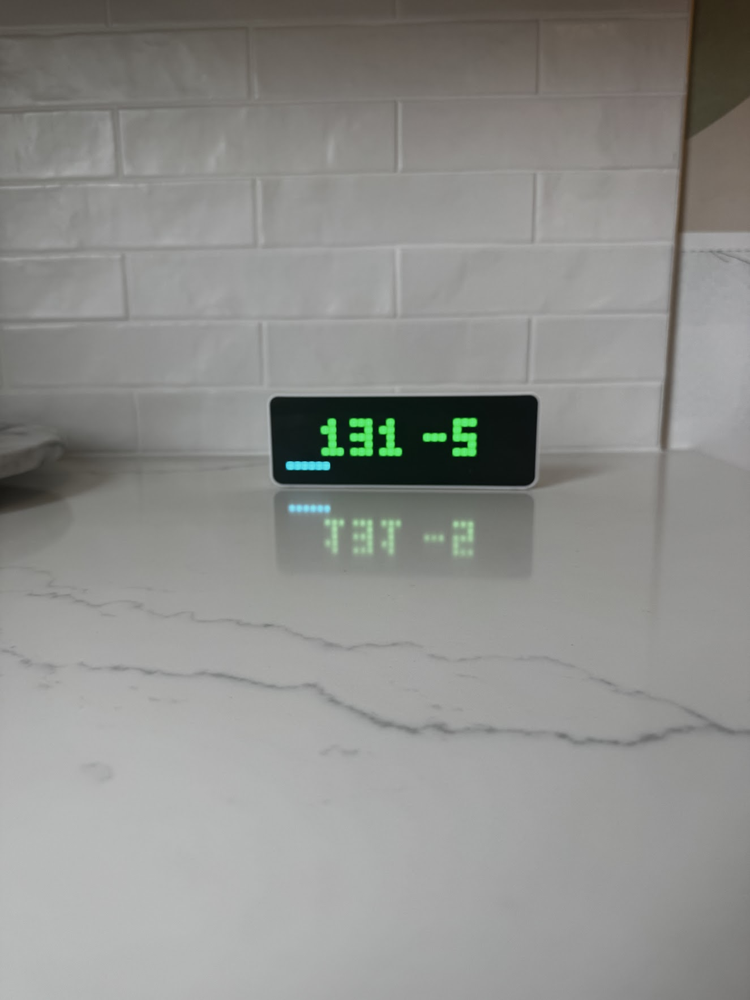

# BG_0001 a Dexcom G7 to LED Display
Service that fetches real-time blood glucose data from your Dexcom G7 CGM and displays it on an LED matrix display (Ulanzi TC001). 

Cost for this is one-time ~$40-50 and ~1 hour of time to configure the environment (see [Hardware](#hardware-used) for links, and [Installation](#installation) for step-by-step instructions). 

Alternatively, if you would rather not do any configuration, you can pay ~$100 USD for the SugarPixel ([link](https://customtypeone.com/products/sugarpixel)), which can do this through a mobile app.
 
## Features

| | |
|---|---|
| <ul><li>**Real-time glucose display**: Shows current blood glucose value in mg/dL</li><li>**Trend arrows**: Displays direction of glucose change (↑ ↓ → ↑↑ ↓↓)</li><li>**Delta tracking**: Shows change from previous reading (e.g., "+5" or "-12")</li><li>**Color-coded alerts**:<ul><li>Red: Low (<70 mg/dL)</li><li>Green: Normal (70-180 mg/dL)</li><li>Yellow: High (181-240 mg/dL)</li><li>Orange: Very high (>240 mg/dL)</li></ul></li><li>**Progress bar**: Shows countdown to next API refresh</li><li>**Rate limiting**: Respects Dexcom API limits (max 1 call per 5 minutes)</li></ul> | How it displays for me:  |

## Hardware Used
- ~$40-50 USD Ulanzi TC001 Smart Pixel Clock ([Amazon US link](https://www.amazon.com/ULANZI-TC001-Smart-Pixel-Clock/dp/B0CXX91TY5))
    
    - Modded using *AWTRIX3* [instructions](https://blueforcer.github.io/awtrix3/#/).
    - When modding the Ulanzi TC001, use a high-speed USB-C data cable (took a long time to realize and fix that when I was modding it)

- ~$0 Local computer or Raspberry Pi (as the bridge to send data to TC001)

    - Note: This computer needs to be connected and always on to send updates to Ulanzi TC001

## Display Format

```
120→ +3
```

- `120` - Current glucose value in mg/dL
- `→` - Trend arrow (stable, rising, falling)
- `+3` - Change since last reading

### Arrow Logic

| Delta (mg/dL) | Arrow | Meaning |
|---------------|-------|---------|
| ±0-19 | → ↑ ↓ | Stable/gradual change |
| ±20+ | ↑↑ ↓↓ | Rapid change |

## Architecture

```
┌─────────────────┐     ┌─────────────────┐     ┌─────────────────┐
│   Dexcom G7     │────▶│   Cloud Run     │◀────│  Local Bridge   │
│   (CGM)         │     │   (FastAPI)     │     │    (Python)     │
└─────────────────┘     └─────────────────┘     └────────┬────────┘
                                                         │
                                                         ▼
                                                ┌─────────────────┐
                                                │    AWTRIX3      │
                                                │  (LED Display)  │
                                                └─────────────────┘
```

1. **Cloud Run Service**: Fetches glucose data from Dexcom Share API via `pydexcom`
2. **Local Bridge**: Polls Cloud Run and pushes to your AWTRIX3 on your local network

## Prerequisites

- Python 3.9+
- Dexcom G7 with Dexcom Share enabled
- At least one follower set up in Dexcom Share
- AWTRIX3 device on your local network
- Google Cloud account (for Cloud Run deployment)

## Repo Structure

```
BG_TC001/
├── app/
│   ├── __init__.py
│   ├── main.py              # FastAPI endpoints
│   ├── config.py            # Environment configuration
│   ├── dexcom_client.py     # Dexcom API wrapper with caching
│   ├── awtrix_formatter.py  # AWTRIX3 JSON formatting
│   └── models.py            # Pydantic models
├── local_bridge/
│   ├── bridge.py            # Polls Cloud Run → pushes to AWTRIX
│   └── config.yaml          # Bridge configuration
├── Dockerfile
├── requirements.txt
├── .env.example
└── README.md
```

## Installation

### 1. Clone and Set Up Environment

```bash
cd /path/to/BG_TC001

# Create virtual environment
python3 -m venv venv
source venv/bin/activate

# Install dependencies
pip install -r requirements.txt
```

### 2. Configure Environment

```bash
# Copy example environment file
cp .env.example .env

# Edit with your Dexcom credentials
nano .env
```

Required environment variables:

| Variable | Required | Description |
|----------|----------|-------------|
| `DEXCOM_USERNAME` | Yes | Dexcom account email/username |
| `DEXCOM_PASSWORD` | Yes | Dexcom account password |
| `DEXCOM_REGION` | No | `us` (default), `ous` (outside US), or `jp` (Japan) |

### 3. Test Locally

```bash
# Start the server
uvicorn app.main:app --reload --port 8080
```

Test the endpoints:

```bash
# Health check
curl http://localhost:8080/health

# Get AWTRIX-formatted glucose data
curl http://localhost:8080/glucose

# Get raw glucose data
curl http://localhost:8080/glucose/raw

# Check rate limit status
curl http://localhost:8080/glucose/status
```

### 4. Test with AWTRIX3

```bash
cd local_bridge

# Single test
python bridge.py --cloud-url http://localhost:8080 --awtrix-ip 192.168.1.87 --once

# Continuous polling (every 60 seconds)
python bridge.py --cloud-url http://localhost:8080 --awtrix-ip 192.168.1.87
```

## Cloud Run Deployment

Note: I use Google Cloud Run for two reasons, but you can use alternative methods (including local hosting). Reasons for using GCP:

1) I plan to read this signal for other displays (i.e., web app, logging, etc.)
2) Google Cloud Run particularly is cheap (est. $0/month for this) and easy to set up. 

### 1. Set Up Google Cloud

```bash
# Install Google Cloud CLI (if not installed)
# https://cloud.google.com/sdk/docs/install

# Authenticate
gcloud auth login

# Set project
gcloud config set project YOUR_PROJECT_ID

# Enable required APIs
gcloud services enable run.googleapis.com
gcloud services enable secretmanager.googleapis.com
```

### 2. Store Secrets

```bash
# Store Dexcom credentials securely
echo -n "your_email@example.com" | gcloud secrets create dexcom-username --data-file=-
echo -n "your_password" | gcloud secrets create dexcom-password --data-file=-
```

### 3. Deploy to Cloud Run

```bash
gcloud run deploy dexcom-awtrix \
  --source . \
  --region us-central1 \
  --allow-unauthenticated \
  --set-secrets="DEXCOM_USERNAME=dexcom-username:latest,DEXCOM_PASSWORD=dexcom-password:latest" \
  --set-env-vars="DEXCOM_REGION=us" \
  --min-instances=0 \
  --max-instances=2 \
  --memory=256Mi
```

### 4. Get Service URL

```bash
gcloud run services describe dexcom-awtrix --region us-central1 --format='value(status.url)'
```

### 5. Configure Local Bridge

Edit `local_bridge/config.yaml`:

```yaml
cloud_run_url: "https://dexcom-awtrix-xxxxx-uc.a.run.app"
awtrix_ip: "192.168.1.87"
app_name: "glucose"
poll_interval: 60
```

Run the bridge:

```bash
cd local_bridge
python bridge.py --config config.yaml
```

## Running as a Service

IMPORTANT: The local bridge script needs to run continuously to poll Cloud Run and push updates to your AWTRIX3. Here's how to set it up as a background service.

### macOS (launchd)

Create `~/Library/LaunchAgents/com.glucose.awtrix-bridge.plist`:

```xml
<?xml version="1.0" encoding="UTF-8"?>
<!DOCTYPE plist PUBLIC "-//Apple//DTD PLIST 1.0//EN" "http://www.apple.com/DTDs/PropertyList-1.0.dtd">
<plist version="1.0">
<dict>
    <key>Label</key>
    <string>com.glucose.awtrix-bridge</string>

    <key>ProgramArguments</key>
    <array>
        <string>/path/to/BG_TC001/venv/bin/python</string>
        <string>/path/to/BG_TC001/local_bridge/bridge.py</string>
        <string>--config</string>
        <string>/path/to/BG_TC001/local_bridge/config.yaml</string>
    </array>

    <key>WorkingDirectory</key>
    <string>/path/to/BG_TC001/local_bridge</string>

    <key>RunAtLoad</key>
    <true/>

    <key>KeepAlive</key>
    <true/>

    <key>StandardOutPath</key>
    <string>/path/to/BG_TC001/local_bridge/bridge.log</string>

    <key>StandardErrorPath</key>
    <string>/path/to/BG_TC001/local_bridge/bridge.error.log</string>

    <key>EnvironmentVariables</key>
    <dict>
        <key>PATH</key>
        <string>/usr/local/bin:/usr/bin:/bin</string>
    </dict>
</dict>
</plist>
```

**Note:** Replace `/path/to/BG_TC001` with your actual project path.

#### Managing the Service

```bash
# Load (start) the service
launchctl load ~/Library/LaunchAgents/com.glucose.awtrix-bridge.plist

# Unload (stop) the service
launchctl unload ~/Library/LaunchAgents/com.glucose.awtrix-bridge.plist

# Check if running
launchctl list | grep glucose

# View logs
tail -f /path/to/BG_TC001/local_bridge/bridge.log
tail -f /path/to/BG_TC001/local_bridge/bridge.error.log

# Restart the service
launchctl unload ~/Library/LaunchAgents/com.glucose.awtrix-bridge.plist
launchctl load ~/Library/LaunchAgents/com.glucose.awtrix-bridge.plist
```

The service will:
- Start automatically when you log in
- Restart automatically if it crashes
- Log output to `bridge.log` and `bridge.error.log`

### Linux (systemd)

Create `/etc/systemd/system/glucose-bridge.service`:

```ini
[Unit]
Description=Glucose AWTRIX Bridge
After=network.target

[Service]
Type=simple
User=pi
WorkingDirectory=/home/pi/BG_TC001/local_bridge
ExecStart=/home/pi/BG_TC001/venv/bin/python bridge.py --config config.yaml
Restart=always
RestartSec=10

[Install]
WantedBy=multi-user.target
```

Enable and start:

```bash
sudo systemctl enable glucose-bridge
sudo systemctl start glucose-bridge
```

## API Endpoints

| Endpoint | Method | Description |
|----------|--------|-------------|
| `/` | GET | Service info |
| `/health` | GET | Health check |
| `/glucose` | GET | AWTRIX3-formatted glucose data |
| `/glucose/raw` | GET | Raw glucose data (debugging) |
| `/glucose/status` | GET | Rate limit status |

## Rate Limiting

The service enforces a 5-minute minimum interval between Dexcom API calls to avoid rate limiting. The progress bar on the AWTRIX display shows the countdown to the next refresh:

- **0%** (empty): Just refreshed
- **100%** (full): Ready for next refresh

## Troubleshooting

### "No glucose reading available"

- Ensure Dexcom Share is enabled in your Dexcom app
- Verify you have at least one follower set up
- Check your credentials in `.env`

### "Connection refused" from bridge

- Make sure the FastAPI server is running
- Check the port number matches

### AWTRIX not updating

- Verify AWTRIX IP address is correct
- Check AWTRIX is on the same network
- Test with: `curl http://YOUR_AWTRIX_IP/api/stats`

## License

MIT

## Acknowledgments

- [pydexcom](https://github.com/gagebenne/pydexcom) - Dexcom Share API client
- [AWTRIX3](https://github.com/Blueforcer/awtrix3) - LED matrix firmware
