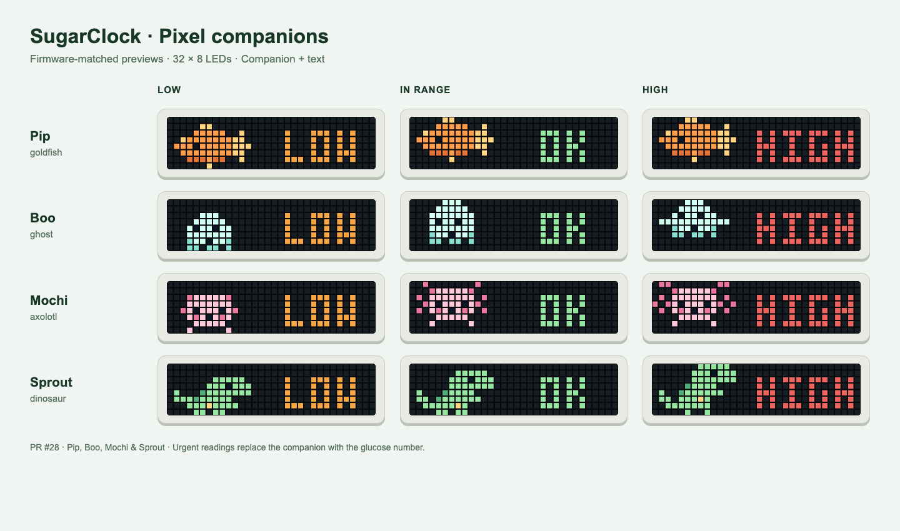

<p align="center">
  
</p>

<h1 align="center">SugarClock</h1>

<p align="center">
  Turn a $40 pixel clock into a real-time glucose display for your desk, nightstand, or kitchen counter.
</p>

<p align="center">
  <a href="https://sugarclock.com/">Website</a> &bull;
  <a href="#quick-start">Quick Start</a> &bull;
  <a href="https://sugarclock.com/#install">Setup Guide</a> &bull;
  <a href="https://sugarclock.com/faq.html">Help & FAQ</a>
</p>

---

## What is SugarClock?

SugarClock is free, open-source firmware that turns the [Ulanzi TC001 Smart Pixel Clock](https://amzn.to/4rrqbjz) into a dedicated CGM (continuous glucose monitor) display. It connects to **Dexcom Share**, **FreeStyle Libre** (via LibreLinkUp), or a **compatible custom JSON endpoint** over WiFi and shows your current glucose reading in big, color-coded numbers on an LED matrix.

**Cost:** ~$40 one-time for the clock. The software is free. No subscriptions.

## Availability

This README describes the latest merged source on `main`. **As of September 12, 2026**, the latest stable release is [v0.2.6](https://github.com/cdemeke/SugarClock/releases/tag/v0.2.6), while the browser and bundled Mac installer firmware remain at **v0.2.2** ([artifact metadata](docs/installer-artifacts.json)). LibreLinkUp, all seven companions, the redesigned dashboard, and the clock's mmol/L display fix are merged but are not yet included in that stable release or the bundled installers. Build from source to use all of these changes, or wait for a release that includes them. Updating to v0.2.6 alone does not add them.

## Features

- **Live glucose display** — Large color-coded numbers (green = in range, orange = high/low, red = urgent)
- **Trend arrows** — See which direction your glucose is heading
- **Dexcom Share & LibreLinkUp** — Fetch readings over WiFi using your Dexcom Share account or a LibreLinkUp follower account; the clock does not connect directly to the sensor
- **Custom JSON & demo mode** — Connect a compatible endpoint, or explore the display with synthetic readings without a CGM account
- **mg/dL or mmol/L** — Readings and deltas use your selected units on the clock and dashboard; mmol/L displays one decimal place
- **Stale-data visibility** — Retains the last reading and trend in a configurable stale color (gray by default); stale readings do not trigger buzzer alerts
- **Auto brightness** — Built-in light sensor adjusts to your room
- **Night mode** — Dims automatically during sleeping hours
- **Web dashboard** — Responsive sidebar navigation, light/dark mode, and a live mirror of the actual LED display. The latest glucose, signed delta, and reading age remain visible even when the clock shows another view
- **Secure WiFi updates** — Signed, power-loss-safe firmware updates with automatic rollback
- **Clock, weather & more** — Also shows time, date, temperature, pomodoro timer, and push notifications
- **Pixel companions** — Seven animated pets with glucose-aware poses, three display styles, and an animated settings preview
- **Easy local access** — Double-click the middle button to scroll the clock's browser address

### Make it yours with pixel companions

Choose **Pip** the goldfish, **Boo** the ghost, **Mochi** the axolotl, **Sprout** the dinosaur, **Pebble** the turtle, **Inky** the octopus, or **Maple** the red panda in **Settings → Display**. Show your pet with range text, a range icon, or by itself. Range text/icons default to red for low/high and green for in range; optionally use your configured glucose colors. Greetings and sleep poses apply only in range. Urgent readings replace the pet with the glucose number, and missing/stale-data warnings take priority.



The dashboard provides previous/next and auto-cycle controls. Its brightness slider selects manual brightness; **Advanced brightness** lets you re-enable the light sensor. Buzzer alerts remain supported by the firmware/API, but their controls are hidden in the redesigned settings because the hardware buzzer is quiet. Existing alert settings are preserved.

## What You Need

| Item | Notes |
|------|-------|
| [Ulanzi TC001 pixel clock](https://amzn.to/4rrqbjz) | ~$40 on Amazon |
| USB-C data cable | Usually included with the clock |
| A computer | Chrome/Edge for browser installation; command-line builds work across platforms |
| WiFi (2.4 GHz) | The clock connects to your home WiFi |
| Dexcom Share account, LibreLinkUp follower account, or compatible JSON URL | See release availability above; demo mode needs no CGM account |

### FreeStyle Libre setup

Libre support uses the unofficial LibreLinkUp follower API and depends on readings being shared to that account. Use a LibreLinkUp follower account, save its credentials in Settings, then use
**Test Connection** to load the people sharing with it. A single person is saved
automatically. If several people share, choose **Person to display** and save.
The clock remembers the person's ID across restarts and stops accepting readings
if that person stops sharing; it never substitutes another person. Changing the
Libre email clears the saved person and detected region, including during Mac setup.

Libre readings require synchronized network time and a valid sensor timestamp
no more than ten minutes old. Test Connection follows the same retry limits as
automatic polling: requests are at least 15 seconds apart, and authorization
rejections back off from five minutes to one hour. A network error during a retry
preserves that cooldown. Saving changed credentials allows a new attempt.
Requests to accept terms, privacy policies, or verify an account retry every
five minutes for the first hour, then back off to 10, 20, 40, and at most 60
minutes. After completing the action in LibreLinkUp, test again once the current
cooldown expires; Test uses the same retry limit as automatic polling.

### Custom URL and Nightscout compatibility

**Custom URL** expects a JSON object with `glucose` in mg/dL, `timestamp` in Unix seconds, and `trend` (for example, `Flat`, `SingleUp`, or `SingleDown`). An optional token is sent as `Authorization: Bearer <token>`.

A Nightscout site root or its standard entries response is **not directly supported** by this parser. Use an adapter that returns the expected object and handles Nightscout authentication. The Mac app's Nightscout option currently saves the site root as a Custom URL; that alone is insufficient.

## Quick Start

1. Connect your Ulanzi TC001 to a computer with a USB-C **data** cable.
2. Open the [browser installer](https://sugarclock.com/#install) in Chrome or Edge and follow its prompts. Check **Availability** above before choosing this route: the bundled image does not yet contain the latest merged features.
3. On current source builds, first-time WiFi setup uses the **SugarClock-Setup** network. Join it from a phone or computer, open `http://192.168.4.1` in a normal browser, and use **WiFi → Join this network**. Older installer builds may present different provisioning steps; follow their on-screen prompts.
4. Once connected, open the clock's local address from a device on the same network to configure your data source, units, ranges, and display. On current source builds, **double-click the middle button** to show that address.

The Mac setup app source is in [onboarding/TC001Setup](onboarding/TC001Setup). The current v0.2.6 release has **no DMG asset**, so the latest-release page is not currently a working Mac app download. Use the browser installer or build from source below.

See the [installation guide](INSTALL.md) for detailed flashing, WiFi setup, and recovery instructions.

<details>
<summary><strong>Advanced: Build from source (all platforms)</strong></summary>

If you'd rather build and flash manually (or you're on Windows/Linux):

```bash
git clone https://github.com/cdemeke/SugarClock.git
cd SugarClock
python3 -m pip install -r requirements-build.txt
pio run && pio run --target buildfs      # build firmware + filesystem
pio run --target upload                   # flash firmware
pio run --target uploadfs                 # flash filesystem
```

Use the first-time WiFi steps above; no source-code credential edits are needed. Open `http://<device-ip>/` for Settings, or use `pio device monitor` to find the IP. For a clock with an older partition layout, follow the [OTA migration instructions](INSTALL.md#one-time-ota-migration-preserve-existing-settings) before flashing.

You may need the [CH340 USB driver](https://sparks.gogo.co.nz/ch340.html) on Windows.

</details>

## Firmware Updates

Version 0.2.0 is the one-time OTA bootstrap release. Install it once over USB so the new
two-slot partition table is present. After that, normal stable releases are checked nightly
over WiFi and installed without the Mac app or USB cable. Existing WiFi, Dexcom, Nightscout,
alert, and display settings remain in NVS during the migration and future updates.

Open the device's **Device** page to check manually, install an available update, enable or
disable automatic installs, or choose the local install hour. Automatic installation is
deferred for low battery, urgent glucose/notifications, an active buzzer or timer, setup/AP
mode, low heap, unavailable time, or lost WiFi. Manifest checks and firmware downloads use
certificate-validated HTTPS, and every release manifest is verified with the public release
key compiled into the firmware.

The running firmware writes updates to the inactive application slot. The new firmware must pass a
15-second local health check before it is marked valid; a crash, watchdog reset, or failed
health check causes the bootloader to restore the previous slot. Internet and CGM availability
are deliberately not part of that health check.

USB flashing remains the recovery path. See [INSTALL.md](INSTALL.md) for the non-erasing
bootstrap migration and recovery commands. Maintainers should follow
[docs/OTA_SIGNING.md](docs/OTA_SIGNING.md) for release signing and key rotation.

For administrators managing multiple clocks, the optional [fleet service](fleet/README.md) supports approved enrollment, remote commands, and managed updates. It requires a separately deployed service; see its setup and privacy documentation.

Companion integrations: see the [configuration API and legacy-field migration notes](docs/companion-api.md).

## Troubleshooting

| Problem | Solution |
|---------|----------|
| Clock not detected via USB | Use a data cable (not charge-only), connect directly (no hub), install CH340 driver |
| Upload fails | Hold middle button while plugging in USB to enter flash mode |
| `NO WIFI` on display | Check SSID/password, make sure it's a 2.4 GHz network |
| `NO DATA` on display | Check source credentials, Libre person selection, or the custom endpoint format in Settings |
| Reading is gray | The last reading is stale; check connectivity and the source's reading age |
| Cannot find local Settings | On current source builds, double-click the middle button; otherwise check your router or serial monitor |
| Latest features are missing | Check your running firmware version against Availability above; merged source and installer versions differ |

See the **[Help & FAQ](https://sugarclock.com/faq.html)** for more.

## Backup & Restore Factory Firmware

```bash
# Backup original firmware (before flashing)
esptool.py -p /dev/cu.usbserial-* -b 921600 read_flash 0x0 ALL tc001_factory_backup.bin

# Restore original firmware
esptool.py -p /dev/cu.usbserial-* -b 460800 write_flash 0x0 tc001_factory_backup.bin
```

## Acknowledgments

- [AWTRIX3](https://blueforcer.github.io/awtrix3/#/) — LED matrix firmware for the TC001 that inspired this project
- [pydexcom](https://github.com/gagebenne/pydexcom) — Dexcom Share API reference
- [nightscout-librelink-up](https://github.com/timoschlueter/nightscout-librelink-up) — LibreLinkUp API reference
- [OpenWeatherMap](https://openweathermap.org/) — Free weather API

## License

MIT
