# SugarClock app screenshots — native design refresh

These are actual captures of the app's SwiftUI screens running on the **iPhone 17 Pro simulator, iOS 26.4**. They use explicitly selected sample clock state, with Bluetooth disabled, and each image is labeled **SCREENSHOT PREVIEW · SAMPLE DATA**. They are suitable for discussing the interface; they do not establish real pairing, Wi-Fi, glucose retrieval or OTA success. No passkey, password, user device identifier or live health data is included.

The design reuses the original icons and light/dark palette from [PR #30](https://github.com/cdemeke/SugarClock/pull/30). See [design notes and asset provenance](../../ios/DESIGN.md).

| Display configuration | Blood sugar configuration · dark |
| --- | --- |
| 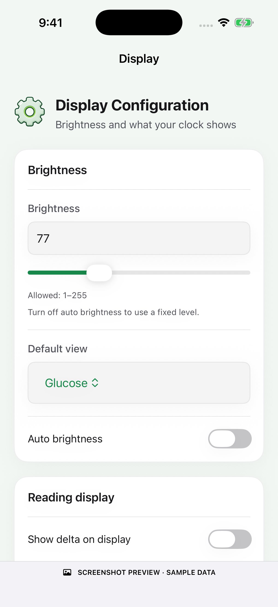 | 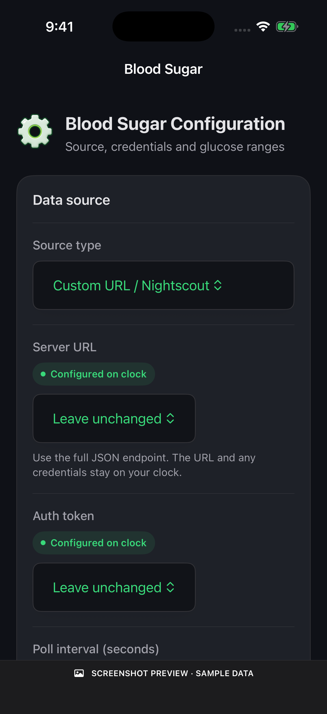 |

| Display · dark | Blood sugar · light |
| --- | --- |
| 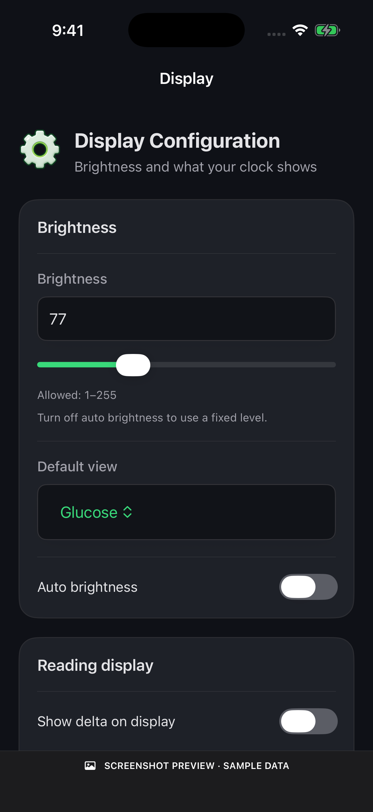 | 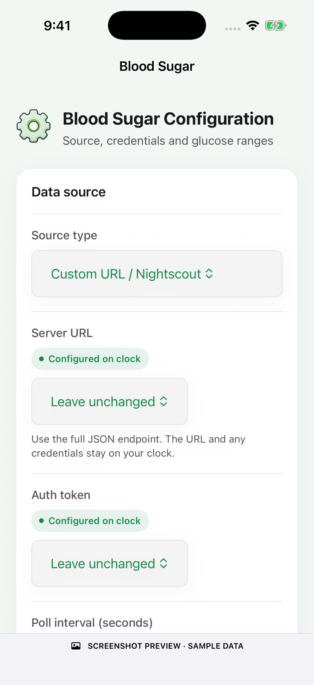 |

| My Clocks | Device settings |
| --- | --- |
| 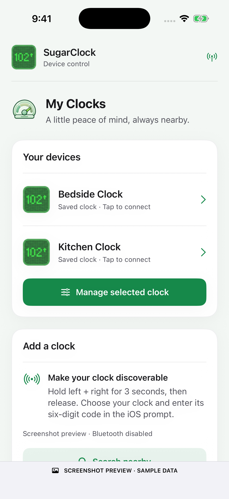 | 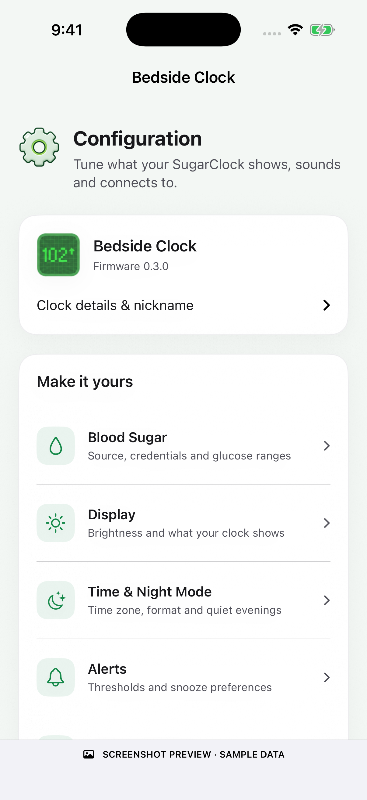 |

| Wi-Fi | Brightness |
| --- | --- |
| 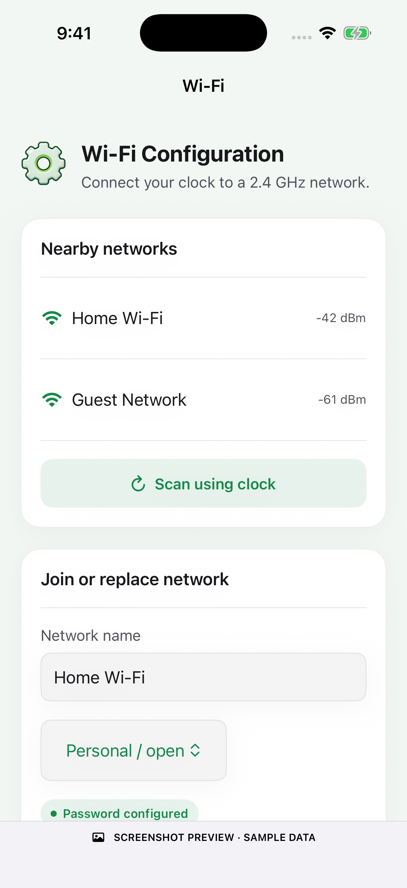 | 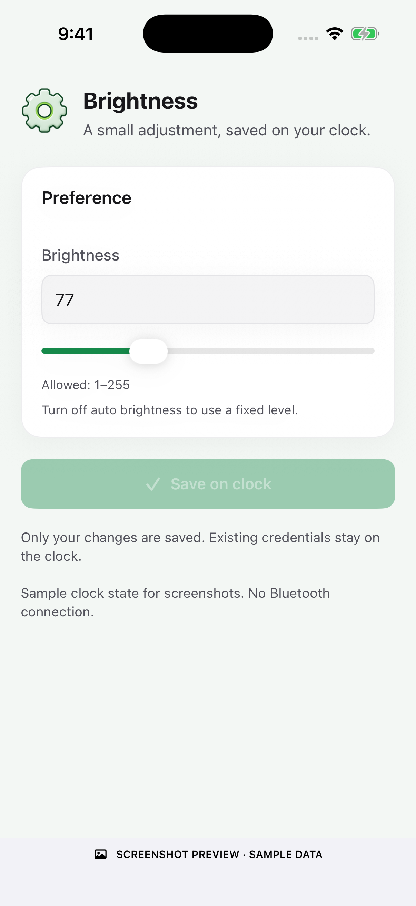 |

| Configured secret | Firmware |
| --- | --- |
| 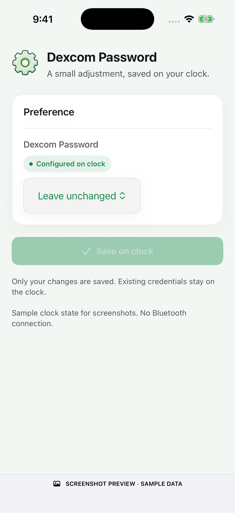 | 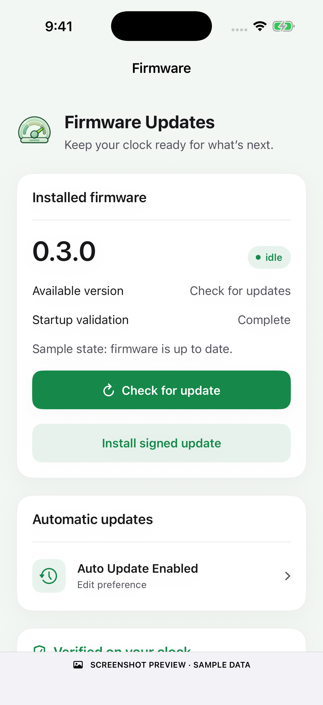 |

| Troubleshooting | Dark mode |
| --- | --- |
| 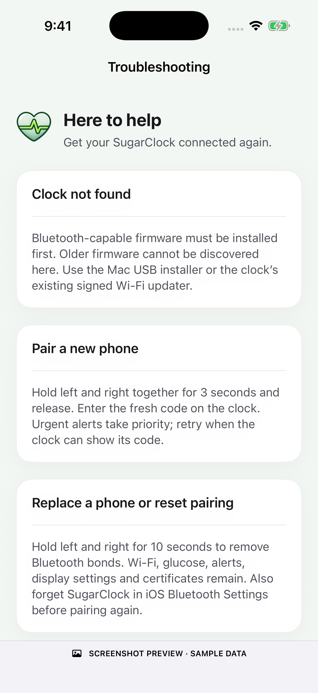 | 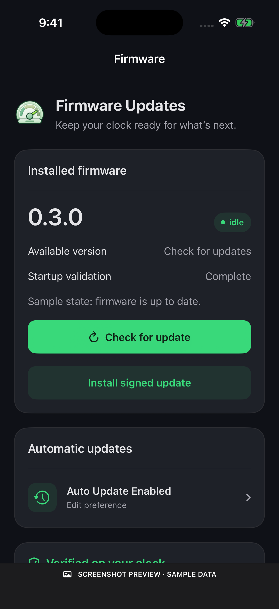 |

[View the large-text accessibility layout](13-large-text.png). This capture verifies visible text wrapping on the simulator; it does not replace hands-on VoiceOver or interaction testing.

## Reproduce

Build the Debug app for iOS Simulator, boot a simulator, then run:

```sh
python3 ios/capture_screenshots.py --app /path/to/Debug-iphonesimulator/SugarClock.app \
  --device YOUR_BOOTED_SIMULATOR_UUID
```

The script installs only into the specified simulator, launches with `SUGARCLOCK_SCREENSHOT`, and captures thirteen views. `ScreenshotPreview.swift` reuses the production views; it is compiled only in Debug. The explicit preview mode does not load saved user preferences, start Core Bluetooth or allow settings actions. Production startup still uses the real transport. No screenshot mode exists in Release.

On the implementation host, Xcode's wrapper tries to install mismatched CoreSimulator components. The already-installed simulator can be used directly via `--simctl /Library/Developer/PrivateFrameworks/CoreSimulator.framework/Versions/A/Resources/bin/simctl`. The Debug SDK build used `EXCLUDED_SOURCE_FILE_NAMES=Assets.xcassets`; the script copies the original branding PNGs into that local simulator bundle. This bypass is for local screenshots, not a successful normal asset-catalog or distribution build. See [verification](../BLE_VERIFICATION.md).

## Key remaining work

- Real ESP32/iPhone pairing and security verification, reconnection/bond recovery, Wi-Fi failure handling, alert continuity, and runtime-memory measurements.
- Configured-clock OTA and legacy USB preservation tests, interrupted saves, OTA rollback, and repeated pressure sessions.
- Repair matching Xcode components; complete normal asset packaging, signed iPhone installation, and owner-controlled TestFlight setup.
- Hands-on Dynamic Type and VoiceOver review. These captures show light/dark rendering and one accessibility-size text layout.
- New enterprise CA upload is still handled by the existing web interface; BLE preserves and uses an already-installed certificate.

The complete checklist is in [BLE_ACCEPTANCE.md](../BLE_ACCEPTANCE.md). No firmware release, physical flash or TestFlight upload has been performed.
