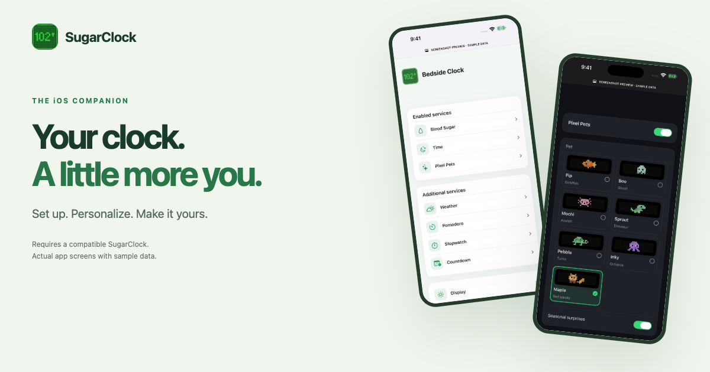

# SugarClock launch kit

A reviewable marketing and App Store preparation package for [PR #29](https://github.com/cdemeke/SugarClock/pull/29). These files do not publish a website or submit an app. Keep the visible draft notices until the owner approves the content and closes the submission gaps.

## Start here

- [Marketing page](site/index.html): responsive, accessible static HTML/CSS using existing SugarClock branding; no analytics, signup backend or new runtime dependency.
- [Apple submission packet](APP_STORE_SUBMISSION.md): current official requirements, copyable fields, evidence and remaining owner/device work.
- [Review notes](REVIEW_NOTES.md): accessory instructions and real phone/clock video shot list.
- [Privacy worksheet](PRIVACY_WORKSHEET.md): local storage, pending secrets, clock/provider/fleet reporting and unanswered operator questions.
- [Metadata JSON](app-store-metadata.json): English name, subtitle, keywords, promotion and description, with owner-only fields explicitly incomplete.

Preview locally from the repository root:

```sh
python3 -m http.server 8765 --bind 127.0.0.1
# Open http://127.0.0.1:8765/ios/launch-kit/site/
```

The proposed public routes are `https://sugarclock.com/ios/`, `/ios/support/` and `/ios/privacy/`. They are not deployed by this PR. All local page links work without those routes. For publication, package the **whole launch-kit asset tree** or rewrite its relative image URLs for the final site layout; replace draft contacts, remove draft/noindex markers only after approval, and verify every public route. Add the finalized privacy link inside the app before App Review. No App Store badge or fabricated download link is included.

## Visual assets



| Files | Intended use | Dimensions |
| --- | --- | --- |
| `assets/01-your-clocks.png` through `05-display.png` | Five designed iPhone product-page panels, in narrative order | 1320 × 2868 each; RGB, no alpha |
| `assets/iphone-*.png` | Five opaque, full-screen iPhone captures | 1320 × 2868 |
| `assets/ipad-*.png` | Five opaque, full-screen iPad captures | 2064 × 2752 |
| `assets/social-1200x630.png` | Share card / press / marketing hero | 1200 × 630 |
| `assets/app-icon-1024.png` | Existing app icon, copied without redesign | 1024 × 1024 |
| `assets/site-desktop.png`, `site-mobile.png` | Full marketing-page review previews | 1440 / 390 pixels wide |
| `screenshots/` and `screenshots/ipad/` | Six original simulator captures per family, including glucose settings | Native device resolution; originals may contain alpha |

Use the **opaque `assets/` exports**, not the raw alpha-bearing `screenshots/` files, for App Store image preparation. The five panels show My Clocks, device settings, pending-change review, Pixel Pets and Display. The supplied iPad set uses actual iPad rendering, not scaled-up iPhone images.

These are real production SwiftUI views populated by the existing, explicit Debug screenshot fixture in app **1.0.0 (24)**. Sample-data labels are retained. There is no radio session, personal glucose reading, real credential, or claim of an executed hardware save in these images. Check every asset against the eventual submitted Release build; they are not evidence that physical acceptance or App Review is complete. Do not present an optional/debug feature as a shipping feature. The fixtures are excluded from Release.

Brand provenance: the icon is copied from `ios/SugarClock/Assets.xcassets/AppIcon.appiconset/icon_appstore.png`; existing app artwork/design lineage is recorded in [DESIGN.md](../DESIGN.md). The pet artwork comes from the actual checked-in app. The green layouts and generic rounded screenshot surrounds are repo-owned HTML/CSS, not Apple device mockups or an Apple endorsement. Owners must confirm asset/integration rights before public use.

## Reproduce the assets

Build the Debug simulator app using the [iOS build instructions](../README.md), boot an iPhone 17 Pro Max and iPad Pro 13-inch simulator, and substitute their actual UUIDs and `.app` path:

```sh
python3 ios/capture_screenshots.py --app /path/to/SugarClock.app \
  --device IPHONE_SIMULATOR_UUID --output ios/launch-kit/screenshots --launch-kit
python3 ios/capture_screenshots.py --app /path/to/SugarClock.app \
  --device IPAD_SIMULATOR_UUID --output ios/launch-kit/screenshots/ipad --launch-kit
```

Rendering requires Node, Playwright 1.62.1 and Google Chrome. These are development tools only, not iOS dependencies. One isolated installation option:

```sh
npm install --prefix /tmp/sugarclock-asset-tools playwright@1.62.1
NODE_PATH=/tmp/sugarclock-asset-tools/node_modules node ios/launch-kit/render-assets.cjs
python3 ios/launch-kit/verify.py
```

The renderer composes the screenshots through HTML/CSS without rewriting their contents, checks overflow and opaque PNG output, and records hashes/dimensions in [asset-manifest.json](asset-manifest.json). It also renders the real landing page at desktop and phone widths. Update the capture version/commit in the renderer when recapturing from another app build. No simulator or screen-changing command touches a physical clock.

## Remaining work before public submission

The owner must confirm publisher/contact details, rights, category/age/medical/export declarations, fleet retention and privacy answers; the final policy needs publication and an in-app link. Real phone/clock review video, physical acceptance and final Release screenshot comparison are still outstanding. An uncut hardware review video is not the same as an optional App Store preview. The launch page deliberately makes no “available now,” medical approval, or uninterrupted Bluetooth claim.

## Verification recorded for this kit

Rendered and visually checked the desktop/mobile page, share card, iPhone panels
and native iPad layout. `verify.py` passed metadata lengths, all local page links,
image alt text, draft indexing markers, dimensions, RGB/no-alpha exports, hashes
and icon provenance. The existing 163 host tests and ESP32 build/layout guards
also passed after the clean-runner CI fixes included with this update. No app
runtime source changed; no new TestFlight build is needed for these materials.
